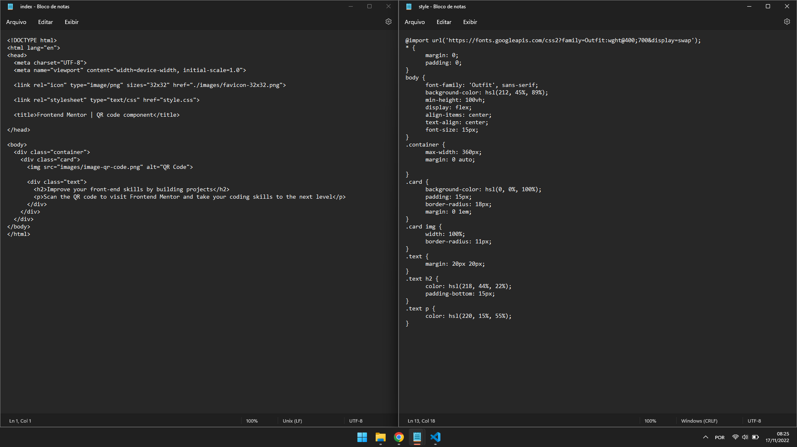

# Frontend Mentor - QR code component solution

This is a solution to the [QR code component challenge on Frontend Mentor](https://www.frontendmentor.io/challenges/qr-code-component-iux_sIO_H). Frontend Mentor challenges help you improve your coding skills by building realistic projects. 

## Table of contents

- [Overview](#overview)
  - [Screenshot](#screenshot)
  - [Links](#links)
- [My process](#my-process)
  - [Built with](#built-with)
  - [What I learned](#what-i-learned)
- [Author](#author)
- [Acknowledgments](#acknowledgments)

## Overview

### Screenshot

### Links

- Solution URL: https://github.com/GeorgeHenriqueDias/qrcodecomponent
- Live Site URL: https://georgehenriquedias.github.io/qrcodecomponent/

## My process

### Built with

- Semantic HTML5 markup
- CSS custom properties

### What I learned

I've learn some new CSS proprieties, like the * element that aplies to the entirety of the html elements.
Another thing is to how center a div in a body. I also learned the very basics of GitHub to hoast my work. It felt a little hard, not gonna lie.

## Author

- Frontend Mentor - [@GeorgeHenriqueDias](https://www.frontendmentor.io/profile/GeorgeHenriqueDias)
- Twitter - [@georgehenridias](https://www.twitter.com/georgehenridias)
